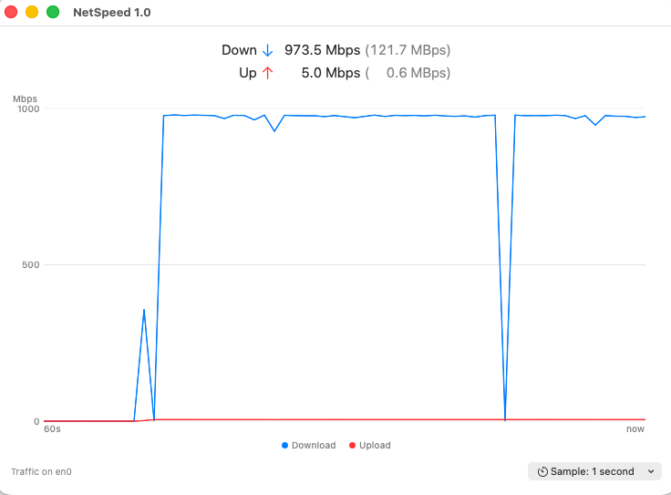

# NetSpeed

A lightweight macOS desktop widget that shows **real-time network throughput** —
download and upload — in a small floating window, with a rolling 60-second graph.

It measures traffic **passively**: it reads the operating system's network
interface byte counters and computes the change each interval, so it never
generates any network load of its own. No speed tests, no background traffic,
nothing written to disk.

<!-- Before publishing, add a screenshot of the running app at docs/screenshot.png -->


## Features

- **Live download & upload**, updated every sample, shown as `X.X Mbps (Y.Y MBps)`
  — Mbps to compare against your ISP plan, MBps for real file-transfer feel.
- **60-second rolling graph**, held in memory only, with two lines — blue for
  download, red for upload, matching Activity Monitor's colors.
- **Sums all physical interfaces** (`en*` — Ethernet, Wi-Fi, wired adapters), so
  the reading reflects your *total* network activity, like Activity Monitor's
  total. Loopback and virtual/VPN interfaces are excluded to avoid double-counting.
- **Adjustable sampling rate**, 1–5 seconds, remembered across launches.
- **Remembers its window position and size**; opens in the top-left on first launch.
- **Follows the system light/dark appearance.**
- **Tiny footprint** — pure SwiftUI, roughly 0.5–1% CPU on an M-series Mac at the
  1-second rate, with stable memory.

## Requirements

- **macOS 26 (Tahoe)** or later
- **Apple Silicon** Mac — the project builds `arm64` only
- **Xcode 26** or later to build

## Build & run

1. Clone the repo and open **`NetSpeed/NetSpeed.xcodeproj`** in Xcode.
2. In **Signing & Capabilities**, select your own **Team**. The project ships with
   the author's team id, so Xcode will prompt you to choose yours; automatic
   signing handles the rest. (Hardened runtime and the App Sandbox are enabled.)
3. Select the **NetSpeed** scheme and press **⌘R** to build and run.

Or from the command line (add your team id, since the checked-in one is the
author's):

```sh
xcodebuild -project NetSpeed/NetSpeed.xcodeproj -scheme NetSpeed \
  -configuration Release -destination 'platform=macOS' \
  -derivedDataPath build DEVELOPMENT_TEAM=YOUR_TEAM_ID build
```

The built app lands at `build/Build/Products/Release/NetSpeed.app`.

## Install for daily use

1. Build the **Release** configuration (the `xcodebuild` line above, or
   **Product → Archive** in Xcode and export a copy of the app).
2. Move **`NetSpeed.app`** into **`/Applications`**.
3. To start it automatically at login, add it in
   **System Settings → General → Login Items**. NetSpeed intentionally does not
   manage login items itself — this keeps it minimal.

Closing the window quits the app; relaunch it to bring it back.

## How it works

Every interval (1–5 s), NetSpeed reads cumulative in/out byte counters for each
physical `en*` interface via `getifaddrs()`, sums them, and divides the change
since the previous reading by the elapsed time to get bits- and bytes-per-second.
The last 60 seconds of samples live in an in-memory ring buffer that feeds the
graph, which is drawn directly with SwiftUI `Canvas`. Nothing is persisted except
your chosen sampling interval and the window frame.

Reading interface counters needs **no elevated privileges** and no helper daemon.

## Not included (by design)

No speed tests or max-capacity measurement, no latency/ping, no per-app or total
data-usage tracking, no long-term logging, and no menu-bar item — this is a small,
focused, personal-use widget. See [`docs/`](docs/) for the full requirements and
the incremental build plan that produced v1.

## License

[MIT](LICENSE) © 2026 ARC3 Solutions

## /\* Begin Note From The Human

**Note:** This copy is literally the only artifact generated by me. The rest is 100% Claude following my instructions.

**The Experiment:**  
The project started as an experiment to answer the question of whether AI has advanced enough to take a relatively small project from conception to production. In short, the answer is: “yes.” I used Claude Opus 4.8 (high and extra high) for the entirety of the project and the result is professional quality.

**Why This Tool:**  
This tool is basically a simplified version of the Apple Activity Monitor’s (AAM) Network tab. While I like the AAM tool, a couple of things have always bugged me about it: 1.) The CPU usage for a passive monitoring tool is excessive. 2\) The real-time graph is the best part and yet it is fixed in a small viewing rectangle and not zoomable or resizable. Accordingly, this tool consumes about one-tenth of the CPU as AAM and uses a fully resizable window.

**Caveats:**

* While I tested this software extensively for functional bugs, measurement accuracy, memory leaks and usability, I am NOT claiming that this software is production ready. I simply do not have near the range of hardware necessary to certify it as such.  
* I’m no longer a certified Apple Developer so I am unable to distribute the finished product through the Apple Store. So if you want this tool, you will either need to build it yourself using XCode or download the released build from GitHub.  
* I set the minimum MacOS as Tahoe and hardware as Apple Silicon only. There’s nothing I know of in the code that would preclude other targets, but I can’t be sure.

**Please Enjoy\!**

## End Note From The Human \*/